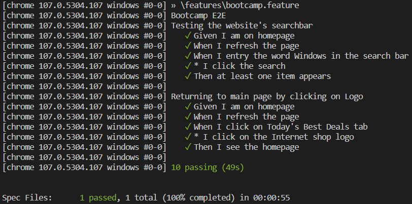

# Hometask: TA-Bootcamp-E2E

## Install the project

1. Clone the repository to your local machine and open it using a program of your choice.
2. Install the dependencies within the project by executing `yarn install` .

 

## Run the tests

- Execute the following command `yarn test` in order to run the test suite.
- Execute the following command `yarn searchbar` or `yarn returnToHomepage` in order to run specific tests.
   
  If you see the following, it means that all tests have been run correctly.
    
  
